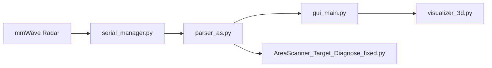
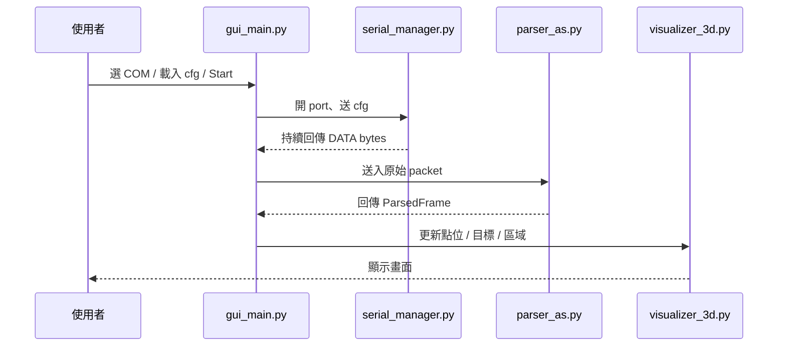

# Area Scanner Python Visualizer

> `Boss` branch 的 Python 版 TI Area Scanner GUI  
> 把 **雷達連線、TLV 封包解析、目標顯示、診斷工具** 整合成一個比較好操作、也比較接近 MATLAB Area Scanner 畫面的專案。

---

## 專案定位

這個版本不只是把視窗打開而已，而是已經把主要流程串起來：

```text
選擇 COM Port -> 載入 cfg -> 傳送設定 -> 接收 DATA Port -> 解析 TLV -> 顯示點雲 / 目標 / 區域
```

如果要一句話介紹這個專案：

> 這是一個用 Python 製作的 TI Area Scanner GUI，能接收雷達資料、解析 TLV 封包，並把動態點、靜態點與追蹤目標顯示在接近 MATLAB 風格的畫面上。

---

## 你可以用它做什麼

| 用途 | 說明 |
|---|---|
| 專題展示 | 用 GUI 呈現雷達資料流與目標顯示結果 |
| 課堂報告 | 跟老師說明 Python 版 Area Scanner 的架構與流程 |
| TLV 解析研究 | 觀察封包 header、TLV type、dynamic/static/target 資料 |
| GUI 比較 | 比對 MATLAB GUI 和 Python GUI 的差異 |
| 除錯診斷 | 用診斷工具確認 target 沒出現是資料問題還是顯示問題 |

---

## 主要特色

### 1. GUI 控制流程完整
- 可以選擇 **CLI Port / DATA Port**
- 可以載入 **`.cfg` 設定檔**
- 可以先做 **Test Connection**
- 可以用 **Start / Stop** 控制接收流程

### 2. 有自己的 TLV 解析器
- 會找 **Magic Word**
- 會拆出完整 packet
- 會解析 **frame header**
- 會解析 **TLV type 1 ~ 11**
- 會把資料整理成 GUI 可直接使用的結構

### 3. 視覺化接近 MATLAB Area Scanner 風格
- 黑底顯示
- X-Y View 為主
- 顯示 **Dynamic / Static / Tracked Target**
- 顯示 **Warning / Critical 區域**
- 顯示 **FOV 線**
- 顯示 **projection line（預判線）**

### 4. 內建診斷能力
- 可觀察目前 packet 裡有沒有 **TLV type 10**
- 可分辨是：
  - 沒收到 target TLV
  - tracker 還沒產生穩定目標
  - GUI 顯示層有問題

---

## 專案架構圖



### 白話版理解
- `serial_manager.py`：負責和雷達通訊
- `parser_as.py`：負責把原始 bytes 解析成結構化資料
- `gui_main.py`：負責整體操作流程與介面控制
- `visualizer_3d.py`：負責把資料畫成畫面
- `AreaScanner_Target_Diagnose_fixed.py`：負責查 target 為什麼沒出現

---

## 環境需求

### Python 版本
建議使用：

```text
Python 3.10.x
```

### 需要安裝的套件

```bash
python -m pip install PySide6 pyqtgraph pyserial numpy
```

### 套件用途對照

| 套件 | 用途 |
|---|---|
| `PySide6` | 建立 GUI 介面 |
| `pyqtgraph` | 畫 2D / 3D 顯示畫面 |
| `pyserial` | 與 CLI Port / DATA Port 通訊 |
| `numpy` | 點位、投影、座標與數值計算 |

---

## 快速開始

### 1. 下載專案

```bash
git clone -b Boss https://github.com/411418154/area-scanner.git
cd area-scanner
```

### 2. 安裝套件

```bash
python -m pip install PySide6 pyqtgraph pyserial numpy
```

### 3. 啟動 GUI

```bash
python main.py
```

### 4. GUI 操作流程

```text
Refresh Ports
-> 選擇 CLI / DATA Port
-> 載入 .cfg
-> Test Connection
-> Start
```

---

## 介面操作建議

### Step 1：重新整理 COM Port
先按 `Refresh Ports`，確認目前電腦看到哪些序列埠。

### Step 2：選擇 CLI / DATA Port
常見設定：
- CLI Port：`115200`
- DATA Port：`921600`

### Step 3：載入 `.cfg`
從 GUI 選擇對應的 TI Area Scanner 設定檔。

### Step 4：先做 Test Connection
先測試基本連線是否正常，再按 Start，會比較容易排除問題。

### Step 5：開始接收
按 `Start` 後，程式會：
- 開啟 serial
- 傳送 cfg
- 持續接收 DATA Port
- 解析 packet
- 更新畫面與統計資訊

---

## 檔案結構

```text
area-scanner/
├─ main.py
├─ gui_main.py
├─ serial_manager.py
├─ parser_as.py
├─ visualizer_3d.py
└─ AreaScanner_Target_Diagnose_fixed.py
```

---

## 各檔案功能說明

### `main.py`
**主程式入口**。

負責：
- 建立 `QApplication`
- 啟動主視窗 `AreaScannerMainWindow`
- 檢查基本 GUI 套件是否可用

一句話理解：
> 整個程式從這裡開始執行。

---

### `gui_main.py`
**GUI 主視窗與流程控制核心**。

負責：
- 建立設定 / 即時監控 / 診斷分頁
- 選擇 COM Port
- 載入 cfg
- 測試連線
- 啟動背景執行緒接收雷達資料
- 更新 viewer 與統計資訊
- 顯示 log 與 parse warnings
- 匯出診斷紀錄

一句話理解：
> 它是整個 Python Area Scanner 的控制中心。

---

### `serial_manager.py`
**序列埠通訊層**。

負責：
- 列出可用 COM Port
- 開啟 / 關閉 CLI Port 與 DATA Port
- 傳送 CLI 指令
- 傳送整份 cfg
- 讀取 DATA Port 原始 bytes
- 清除緩衝區
- 做基本連線測試

一句話理解：
> 它負責跟雷達硬體真正溝通。

---

### `parser_as.py`
**TLV 封包解析器**。

負責：
- 找 Magic Word
- 擷取完整 packet
- 解析 frame header
- 解析 dynamic points
- 解析 static points
- 解析 target list / target index
- 補充診斷資訊與警告訊息

一句話理解：
> 它把原始二進位封包轉成可讀、可用的資料結構。

---

### `visualizer_3d.py`
**畫面顯示模組**。

負責：
- 以 `X-Y View` 為主要顯示模式
- 模擬接近 MATLAB GUI 的畫面風格
- 顯示 dynamic / static / target
- 顯示 FOV 線
- 顯示 warning / critical 區域
- 顯示 projection line
- 支援 `X-Y / Y-Z / X-Z / 3D View`

一句話理解：
> 它把解析後的資料畫成你看到的畫面。

---

### `AreaScanner_Target_Diagnose_fixed.py`
**獨立診斷工具**。

適合用來查：
- 有沒有收到 `TLV type 10`
- 有沒有 dynamic point 但沒有 target
- 目前解析採用的 TLV mode 是哪一種

一句話理解：
> 當 target 沒顯示時，先用它檢查問題出在哪一層。

---

## 程式實際流程



---

## 常見問題

### 1. 為什麼 COM Port 打不開？
可能原因：
- MATLAB GUI 還開著
- TI Visualizer 還開著
- 其他 Python 程式占用同一個 port

建議：
- 一次只保留一個程式使用 COM Port
- 先全部關掉，再重新 `Refresh Ports`

---

### 2. 為什麼 Test Connection 失敗？
可能原因：
- CLI / DATA Port 選錯
- baud rate 設錯
- 雷達尚未正常連接
- `.cfg` 不對應目前板子或 firmware

---

### 3. 為什麼有點雲但沒有 target？
常見情況：
- 資料裡根本沒有 `TLV type 10`
- 有 `TLV type 10`，但 tracker 還沒有分配出穩定目標
- 人移動太短、太快、太遠，導致目標不穩定

建議：
- 先執行 `AreaScanner_Target_Diagnose_fixed.py`
- 觀察 `tlv_types`、`dyn`、`targets` 是否正常

---

### 4. 為什麼 GUI 沒有更新？
先檢查：
- Start 後 log 有沒有持續更新
- DATA Port 有沒有 bytes 進來
- packet 有沒有成功解析
- parse warnings 有沒有大量錯誤

---

## 使用前注意事項

### 1. CLI / DATA Port 不要接反
常見設定是：
- CLI：`115200`
- DATA：`921600`

如果接反，常見現象會是：
- CLI 指令沒有正常回應
- DATA 一直空的
- 解析結果錯誤

### 2. 同時間不要多個程式一起搶 COM Port
避免同時開：
- MATLAB GUI
- TI Visualizer
- Python GUI

### 3. 需要自行準備 `.cfg`
這個分支主要提供 Python 程式碼，執行時需要另外選擇適合的 TI `.cfg` 檔。

---

## 這個分支的優點

這個 `Boss` 分支的優點，不只是功能有做出來，而是它的架構也很適合拿來介紹：

- 主程式入口清楚
- GUI 控制流程清楚
- serial 與 parser 分層明確
- viewer 獨立模組化
- 額外有診斷工具可用

也就是說，它不只是能跑，還**很適合拿來做專題說明與功能拆解**。

---

## 後續還可以再改進什麼

如果之後要再升級，可以考慮補：

- `requirements.txt`
- 範例 `.cfg`
- 實際執行畫面截圖
- 不同板子對應的設定說明
- target 顯示範例圖
- 更完整的錯誤排除說明
- README 首圖 / 架構圖 / 操作圖

---

## 給老師看的簡短介紹

這份程式的重點不是只把雷達資料讀出來，而是把：

- 雷達連線
- TLV 封包解析
- GUI 顯示
- 目標診斷

整合成同一個 Python Area Scanner 工具。

如果要用一句話總結：

> 這是一個以 Python 製作的 TI Area Scanner 視覺化程式，能夠完成雷達連線、TLV 解析、目標顯示與診斷，並以接近 MATLAB GUI 的方式呈現。
