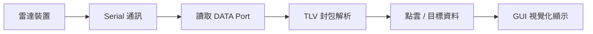

# 📡 Area Scanner（Boss 分支）

<p align="center">
  <b>TI mmWave Area Scanner Python GUI 專案說明</b><br>
</p>

---

## ✨ 專案簡介

本專案是 **TI Area Scanner** 的 Python 版本圖形介面程式，
主要用途是將毫米波雷達輸出的 **TLV 封包資料** 即時接收、解析，並顯示成接近官方 MATLAB Area Scanner 的視覺化畫面。

這個版本的重點不是只有開啟視窗，而是把整體流程串接完成：

- 讀取 **CLI Port / DATA Port**
- 載入 **`.cfg` 設定檔`**
- 將設定送到雷達
- 持續接收 **TLV 二進位資料**
- 解析封包中的點雲與追蹤目標
- 顯示為接近官方風格的 **X-Y 視覺化介面**

---

## 🎯 專案重點

<table>
<tr>
<td width="33%" align="center">

### 🖥️ 圖形介面
提供設定頁、即時監控頁、診斷頁，
方便查看連線、資料與畫面結果。

</td>
<td width="33%" align="center">

### 🧩 TLV 封包解析
將雷達輸出的二進位封包拆解成
Dynamic / Static / Target 等資料。

</td>
<td width="33%" align="center">

### 📈 即時視覺化
將解析後的結果顯示為
接近 MATLAB 的 X-Y 監控畫面。

</td>
</tr>
</table>

---

## 🏗️ 系統流程



### 簡單說明

1. **雷達輸出資料**：雷達會透過序列埠送出封包資料。  
2. **Python 接收資料**：程式透過 CLI Port 與 DATA Port 和雷達溝通。  
3. **解析 TLV 封包**：把封包拆成不同型別的資料內容。  
4. **畫面更新**：將解析結果顯示在 GUI 中。  

---

## 🧠 程式架構

```text
area-scanner/
├─ main.py
├─ gui_main.py
├─ serial_manager.py
├─ parser_as.py
├─ visualizer_3d.py
└─ AreaScanner_Target_Diagnose_fixed.py
```

### 各檔案功能

| 檔案名稱 | 功能說明 |
|---|---|
| `main.py` | 程式入口，負責啟動整個 GUI。 |
| `gui_main.py` | 主視窗與操作流程控制，包含設定、執行、停止、顯示狀態。 |
| `serial_manager.py` | 管理 CLI Port / DATA Port，負責送出 cfg 與接收序列資料。 |
| `parser_as.py` | 解析 TLV 封包，拆出點雲、side info、target list 等資料。 |
| `visualizer_3d.py` | 顯示視覺化畫面，包含 X-Y View、警戒區、FOV 線、目標投影線。 |
| `AreaScanner_Target_Diagnose_fixed.py` | 診斷工具，用來確認資料流中是否真的有 target 資訊。 |

---

## 🖼️ 畫面特色

此版本視覺化畫面的設計方向，是盡量接近 TI 官方 Area Scanner 常見的監控風格：

- 黑色背景
- X / Y 座標軸
- FOV 視野線
- Warning / Critical 區域
- Dynamic point / Static point / Tracked target 顯示
- Target projection line（預測移動線）
- 左上角 frame 資訊顯示

### 顯示資料類型

| 類型 | 說明 |
|---|---|
| Dynamic Points | 動態點雲，代表移動中的反射點。 |
| Static Points | 靜態點雲，代表固定背景或靜止物體。 |
| Tracked Targets | 經過追蹤演算法整理後的目標。 |
| Projection Line | 根據目前速度推算出的短時間預測方向。 |

---

## ⚙️ 執行環境

### 建議版本

- Python **3.10.x**
- PySide6
- pyqtgraph
- pyserial
- numpy

### 安裝方式

```bash
python -m pip install PySide6 pyqtgraph pyserial numpy
```

---

## ▶️ 執行方式

```bash
python main.py
```

執行後可依序完成以下步驟：

1. 選擇 **CLI Port** 與 **DATA Port**  
2. 載入 **`.cfg` 檔案**  
3. 測試連線  
4. 按下 **Start** 開始接收與顯示資料  

---

## 🔌 與雷達的連線概念

本系統使用兩個序列埠：

| Port | 用途 | 常見 Baud Rate |
|---|---|---|
| CLI Port | 傳送設定指令給雷達 | 115200 |
| DATA Port | 接收雷達輸出的 TLV 資料 | 921600 |

### 說明

- **CLI Port**：負責送出像 `sensorStart`、`profileCfg`、`frameCfg` 這類文字指令。  
- **DATA Port**：負責接收雷達輸出的二進位封包資料。  
- 若兩個 Port 接反，可能會導致：  
  - 指令沒有正常回應  
  - DATA 沒有收到資料  
  - 畫面沒有顯示正確結果  

---

## 📦 TLV 封包解析重點

TLV 是 **Type-Length-Value** 的資料格式。  
此專案會將封包中的不同 TLV 類型拆開處理。

### 常見解析內容

| TLV Type | 資料內容 |
|---|---|
| Type 1 | Dynamic detected points |
| Type 7 | Dynamic side info |
| Type 8 | Static detected points |
| Type 9 | Static side info |
| Type 10 | Tracked target list |
| Type 11 | Target index |

### 白話理解

- **Type 1 / 8**：代表點的位置資料  
- **Type 7 / 9**：代表點的輔助資訊  
- **Type 10 / 11**：代表整理後的追蹤目標結果  

---

## 🧪 診斷工具

專案中另外提供：

```bash
python AreaScanner_Target_Diagnose_fixed.py
```

這支程式的用途是：

- 確認目前資料流裡是否有 **TLV Type 10**  
- 判斷是「沒有 target 資料」還是「GUI 沒有畫出來」  
- 幫助快速檢查 parser 與 tracker 狀態  

這對於分析問題很有幫助，因為可以先把「資料沒有進來」和「畫面沒有更新」分開判斷。

---

## ✅ 本版本的特色整理

- 已有 **完整 GUI 主流程**
- 已可進行 **序列埠連線與 cfg 傳送**
- 已可解析 **Area Scanner TLV 封包**
- 已可顯示 **動態點、靜態點、追蹤目標**
- 視覺化畫面朝 **TI 官方 MATLAB 風格** 靠近
- 另外提供 **target 診斷工具**，方便除錯

---

## 📘 適合快速理解的一句話

> 這個專案的核心，是將 TI Area Scanner 雷達輸出的 TLV 封包資料，透過 Python 完成接收、解析與 GUI 視覺化顯示，作為接近官方監控介面的展示系統。

---

## 📝 備註

- 使用前需確認電腦已安裝 Python 與必要套件。  
- 使用時需搭配正確的 mmWave 雷達硬體與 `.cfg` 設定檔。  
- 同一時間不建議與其他佔用序列埠的程式同時開啟。  

---

<p align="center">
  <b>TI Area Scanner Python GUI</b><br>
</p>
